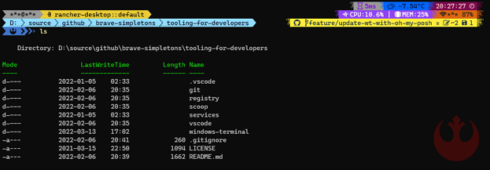

# Windows terminal

Windows Terminal is the great new one. It includes a lot of cool features like tabs, multiple CLI, and settings to make it nice :smile:

But, you may want to turn it into WOW.

> :warning: WARNING :warning:
>
> Here we will only talk about the installation and configuration on Windows OS even though it should be very similar.

## Overview

Here, we will describe all the steps to make your terminal look astonishingly `WOW` so that your coworkers will be jealous how much you can `Shell Like a Badass` :sunglasses:

<!-- FIXME: Update the image -->


This is our own theme named `new-rebels.omp.json`

## Installation Instructions

> :warning: WARNING :warning:
>
> We assume that your current terminal will be at the root of this repo.

### Install Scoop

> :memo: NOTE :memo:
>
> It could be installed separately, but since we are lazy enough, we will be using [Scoop](../scoop/README.md).

First, if it's not already installed (what are you waiting for!), you will need to install scoop using:

```powershell
./scoop/scoop.base.install.ps1
```

This script will also add our special "[brave-simpletons 'scoop-the-business'](https://github.com/brave-simpletons/scoop-the-business)" bucket for scoop.

#### Adding Buckets

You will also need specific known buckets for this to work:

```powershell
scoop bucket add nerd-fonts
# If you already had scoop, you must add our 'special bucket' using this command
scoop bucket add business 'https://github.com/brave-simpletons/scoop-the-business.git'
```

### Install all required applications

Because you are using scoop, the installation of ALL the apps will be easy. Following these instructions will install:

- Windows-Terminal : The new terminal in the Block
- PowerShell 7 : The successor to PowerShell 5 shell
- Posh-Git : Git auto completion in PowerShell
- Oh-My-Posh : Prompt theme engine
- ~Sudo : To force elevated privilege~ [obsolete: now nerd-fonts can be installed per user]
- Cascadia-Code fonts

```powershell
# you should always update scoop before working with it
scoop update
scoop install windows-terminal pwsh posh-git oh-my-posh Cascadia-Code CascadiaCode-NF CascadiaCode-NF-Mono
```

> :memo: NOTE :memo:
>
> Oh-My-Posh support other shell like Bash, Zsh, ... but, it will not be explained in this post. You can get more information on the [installation documentation](https://ohmyposh.dev/docs/) page of oh-my-posh.

## Configuration

### Enabling Oh-My-Posh and Posh-Git in PowerShell 7

#### Using a script

These steps will enable Oh-My-Posh and Posh-Git

Open PowerShell 7 from your Windows menu or by typing `pwsh.exe` in the command line. Then execute the script:

```powershell
# Execute the Script in PowerShell 7 (pwsh.exe)
pwsh.exe ./windows-terminal/config/configurePwsh7.ps1
```

At the end of the script execution, it should ask some manual actions. Do to so, continue with the [Steps after the manual or scripted setup](#steps-after-the-manual-or-scripted-setup).

#### Manual setups

From the windows-terminal directory of this repository, copy the file `.\themes\new-rebels.omp.json` to the oh-my-posh themes' directory. If you are using scoop, it's usually in `$env:userprofile\scoop\persist\oh-my-posh\themes`. But you can also use this command to know where to copy it: `scoop prefix oh-my-posh` :wink:

Now, continue with the [Steps after the manual or scripted setup](#steps-after-the-manual-or-scripted-setup)

#### Steps after the manual or scripted setup

1. In the windows explorer (within this repo)
2. Go to `./windows-terminal/config`
3. Manually copy the folder "PowerShell" (and its content)
4. Paste the "PowerShell" folder into your `$env:UserProfile/Documents` (aka.: "%UserProfile%/Documents" or "~/Documents").

> :warning: IMPORTANT :warning:
>
> Because some Antivirus may find the `PowerShell` folder or file creation identify them as a threat, it is easier to create it manually :wink:

Reload the PowerShell Profile by launching a new `pwsh.exe` instance or reload the profile in an active PowerShell session using `. $PROFILE`.

Now PowerShell should have some color... But with weird characters. It will be necessary to do some extra steps for:

- [Windows-Terminal](#enabling-powershell-7-in-windows-terminal)
- [VsCode](#enabling-powershell-7-in-vscode)

### Enabling PowerShell 7 in Windows Terminal

Open Windows terminal from your Start Menu or from the command line, using `wt.exe`

> :memo: NOTE :memo:
>
> It may be possible that Windows Terminal will use PowerShell 7 as the default. So the next steps may have to be adjusted since it is written as if it wasn't available nor the default one.

#### Version 1.12 or later

With the new Windows Terminal versions (starting with 1.12), you can relatively easily add and modify profiles without going explicitly into the `settings.json`. The `settings.json` still exists and if you want to modify it directly, follow the steps like described in [earlier versions of windows terminal](#versions-earlier-to-112).

1. Click on the plus sign and create a new one (you can also duplicate from an existing profile)
2. Give it a name, `Rebel` for example :wink:
3. Choose the Command line executable path (for pwsh, if you installed it with scoop you can only use `pwsh.exe`)
4. Identify a starting directory (which could be `%UserProfile%` for example)
5. For the icon, the predefined (within windows OS) for pwsh is `ms-appx:///ProfileIcons/{574e775e-4f2a-5b96-ac1e-a2962a402336}.png`
6. In the Appearance section:
   1. In the "Text" subsection:
      1. For the color scheme, the default `Campbell` works fine, but you can choose anyone that you want. You could event create a new "Color Scheme" for your Windows Terminal.
      2. For the Fonts, choose `CaskaydiaCove NF`
      3. For the font size we use `10` points
   2. In the "Background image" subsection:
      1. For the image path, choose the backgrounds available in `[this folder]\config\backgrounds\rebel.png` (copy and paste it where you want and use the new location)
      2. For the stretch mode, choose `None`
      3. For the alignment, choose `Bottom right`
      4. For the opacity, `20%`can be a good start
   3. In the "Window" subsection:
      1. Use a Padding of `8`
7. Save it
8. Now the new `Rebel` profile will be available as a new profile in the windows terminal. You could even chose this profile as the Startup Default profile.

##### Tips for a specific background logo

If you prefer a different "background logo" than the one we propose here, you can... Obviously :wink:

A little trick though, if you want the logo to be aligned (right and bottom) with the `new-rebels.omp.json` theme, make sure that the png logo is 27px wider and 80px higher. So the logo should be aligned with the top left corner and kept 27px (right) and 80px (bottom) cleared and transparent.

#### Versions earlier to 1.12

Open the Windows terminal settings in a text editor (aka: "%UserProfile%\AppData\Local\Microsoft\Windows Terminal\settings.json") and add this in the `profiles.list[]` then save it:

```json
      {
          "guid": "{574e775e-4f2a-5b96-ac1e-a2962a402336}",
          "name": "PowerShell 7",
          "commandline" : "%UserProfile%\\scoop\\apps\\pwsh\\current\\pwsh.exe",
          "fontFace" : "CaskaydiaCove NF",
          "fontSize": 10,
          "source": "Windows.Terminal.PowershellCore",
          "startingDirectory": "~",
          "hidden": false
      }
```

If you already have that `guid` in the Settings.json file, then only add the `fontFace`, `fontSize` and you could adapt the `startingDirectory` too.

The `guid` is the actual PowerShell 7 guid's value.

##### Enforcing PowerShell 7 as the default shell

If you want to always use PowerShell 7 as the default in Windows Terminal (which is optional :wink:), you can set it in the settings of Windows Terminal by replacing the value of `defaultProfile` with the value in the `guid`.

You should then have something like this:

```json
  "defaultProfile": "{574e775e-4f2a-5b96-ac1e-a2962a402336}",
```

### Enabling PowerShell 7 in VsCode

Open the `settings.json` file of the VSCode and change the values of these settings (if already configured):

```json
    "powershell.powerShellAdditionalExePaths": [
        {
            "exePath": "[HARD-CODE-THE-PATH-TO-SCOOP]\\scoop\\apps\\pwsh\\current\\pwsh.exe",
            "versionName": "Pwsh7"
        }
    ],
    "powershell.powerShellDefaultVersion": "Pwsh7",

    "terminal.integrated.fontFamily": "CaskaydiaCove NF",
    "terminal.integrated.defaultProfile.windows":"Pwsh-Profile-Name-You-Want",
    "terminal.integrated.profiles.windows": {
        "Pwsh-Profile-Name-You-Want": {
            "path": "pwsh.exe",
            "args": [
                "-NoLogo"
            ]
        }
    }
```

> :warning: WARNING :warning:
>
> To use the same theme and features in VSCode between `pwsh` and the VSCode's `Powershell Integrated console` (using pwsh 7), you will have to duplicate the Powershell profile with a command similar to this one:
>
> ```powershell
> copy $env:Userprofile\Documents\PowerShell\Microsoft.PowerShell_profile.ps1 $env:Userprofile\Documents\PowerShell\Microsoft.VSCode_profile.ps1
> ```
>
> Reloading vscode afterward is recommended

Open a new terminal in VSCode and Voilà!

> :memo: NOTE :memo:
>
> You may need to close VSCode and reopen it if it was open when you installed "posh-git" with Scoop

## Personalize the `new-rebels` theme

You may require to do some customization of the theme.

### Customize the Weather segment

If you want the weather segment, you must use your own API Key to Open Weather Map. You can read from the Oh-My-Posh documentation on the [Open Weather Map](https://ohmyposh.dev/docs/owm).

In the `new-rebels.omp.json` theme, you will have to replace the two values started with `<ENTER-YOUR-OWM-` with your own API Key and location.

### Customize the shell logo

By default, we use the \uf1d0 charater which is the rebel logo. If you want a specific one (or a text), well you can "rebel" !

You can define what you want to see using the `$env:OHMYPOSH_SHELL_LOGO` and assign it some text or a specific character.

> :warning: WARNING :warning:
>
> You won't be able, for example, to use the same "\uf1d1" text as in the theme template since it won't be translated to nerd-fonts. You must copy/paste the character that you want and it may looks like a weird or `` character.
>
> If you want to identify and copy the exact character that you want from CascadiaCode-NF font, you can use `fontforge`, also in scoop (from the bucket "extras").

### Enabling/Disabling sensitive data to be shown

We also add the ability to enable/disable sensitive data to be shown.

By default, if you followed all our steps, the sensitive data is enabled and will be shown (`$env:OHMYPOSH_SHOW_SENSITIVE_DATA=$true`).

So if you want your userid, computer name and wifi SSID to be masked with `*`, just disabled it with any other value in the environment variable such as, `$env:OHMYPOSH_SHOW_SENSITIVE_DATA=$false`

## Enhance productivity with some apps

### Install other applications

If you are like us and working with scoop, Docker and Kubernetes, you could also install these apps:

```powershell
scoop update
scoop install dotnet-sdk dockercompletion dos2unix helm istioctl kubectl kubectx kubens lens pskubectlcompletion scoop-completion vscode
```

> :memo: NOTE :memo:
>
> We uses the K8S within Docker Desktop. If it's not the case other cool apps can also be install from scoop

### Enabling these other applications in PowerShell 7 (optional)

Of course this is optional depending on each applications you installed, but you could have a pwsh `$PROFILE` that could be looking like this (feel free to only use what you really need):

```powershell
$env:POSH_GIT_ENABLED = $true
# To use a specific char as a logo, use the character from its unicode ex :  => \uf1d0
$env:OHMYPOSH_SHELL_LOGO = "" #  is the \uf1d0 (rebel) character
# The "OHMYPOSH_SHOW_SENSITIVE_DATA" environment variable is used to enable "sensitive data" to be shown (useful to disabling it when presenting and still having a "kickass" shell)
$env:OHMYPOSH_SHOW_SENSITIVE_DATA = $true # possible values to enabling sensitive data to be shown : [$true, "True", "true"] any other values will hide the sensitive data

Invoke-Expression (oh-my-posh --init --shell pwsh --config "$(scoop prefix oh-my-posh)\themes\new-rebels.omp.json")

# Alias
Set-Alias -Name d -Value docker
Set-Alias -Name h -Value helm
Set-Alias -Name i -Value istioctl
Set-Alias -Name k -Value kubectl
Set-Alias -Name ktx -Value kubectx
Set-Alias -Name kns -Value kubens

# Autocompletes
Import-Module posh-git
Import-Module scoop-completion
Import-Module DockerCompletion
Import-Module PSKubectlCompletion

## Helm Autocomplete
helm completion powershell | Out-String | Invoke-Expression

## Istioclt Autocomplete
istioctl completion powershell | Out-String | Invoke-Expression

## PowerShell parameter completion shim for the dotnet CLI autocomplete
Register-ArgumentCompleter -Native -CommandName dotnet -ScriptBlock {
     param($commandName, $wordToComplete, $cursorPosition)
         dotnet complete --position $cursorPosition "$wordToComplete" | ForEach-Object {
            [System.Management.Automation.CompletionResult]::new($_, $_, 'ParameterValue', $_)
         }
}

## SCOOP update and cleanup
function Start-ScoopUpdate {
  Param(
    [switch]
    $Full
  )

  if($Full.IsPresent) {
    scoop update * && scoop cleanup * && scoop cache rm * && scoop cache show
  }
  else {
    scoop update && scoop status
  }
}

Set-Alias -Name scoop-update -Value Start-ScoopUpdate

## obtain the AD memberGroups of a user
function Get-ADMemberOf($userName, $subset) {
  if ([string]::IsNullOrWhiteSpace($subset)) {
    return (Get-ADUser $userName –Properties MemberOf).MemberOf
  }
  return (Get-ADUser $userName –Properties MemberOf).MemberOf | Select-String "$subset"
}
function Get-ADUserName($userName) { Get-ADUser -Filter {anr -eq $userName} | Where-Object Enabled -eq "True" }
function Get-ADUserInfo($userName) { Get-ADUser -Filter {anr -eq $userName} | Select Enabled, SamAccountName, Name, UserPrincipalName }

Set-Alias -Name adgrp -Value Get-ADMemberOf
Set-Alias -Name adusr -Value Get-ADUserName
Set-Alias -Name adinfo -Value Get-ADUserInfo
```

To open your profile, from `pwsh.exe`, simply use (or use your preferred EDI):

```powershell
notepad $PROFILE
```

> :memo: NOTE :memo:
>
> These tools do works with PowerShell 5 too. You could run the same command in PowerShell 5 to update it's $PROFILE to add these.
>
> You can also add `Import-Module posh-git`. But it's no use to add the "oh-my-posh" invoke command, since it's not supported. To use something similar you will have to use the old "[Oh-My-Posh v2](https://github.com/JanDeDobbeleer/oh-my-posh2)" which is no longer supported.

## Some references

- [Windows Terminal Tips and Tricks](https://devblogs.microsoft.com/commandline/windows-terminal-tips-and-tricks/)
- [What is Windows Terminal?](https://docs.microsoft.com/en-ca/windows/terminal/)
