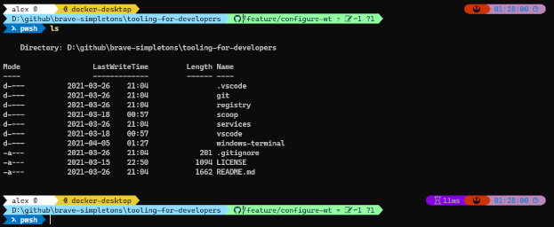

# Windows terminal

Windows Terminal is the great new one. It includes a lot of cool features like tabs, multiple CLI, and settings to make it nice :smile:

But, you may want to turn it into WOW.

## Overview

Here, we will describe all the steps to make your terminal look astonishingly WOW so that your coworkers will be jealous how much you can `Shell Like a Badass` :sunglasses:



> :memo: NOTE :memo:
>
> It could be installed separately, but since we are lazy enough, we will be using [Scoop](../scoop/README.md).

## Installation Instructions

> :warning: WARNING :warning:
>
> We will assume that your current terminal will be at the root of the repo.

### Install Scoop

First, if it's not already installed (what are you waiting for!), you will need to install scoop using:

```powershell
./scoop/scoop.base.install.ps1
```

#### Adding Buckets

You will also need specific known buckets for this to work:

```powershell
scoop buckets add extras
scoop buckets add nerd-fonts
```

### Install all required applications

Because you are using scoop, the installation of ALL the apps will be easy. Following these instructions will install:

- Windows-Terminal : The new terminal in the Block
- PowerShell 7 : The successor to PowerShell 5 shell
- Posh-Git : Git auto completion in PowerShell
- Oh-My-Posh3 : Prompt theme engine
- Sudo : To force elevated privilege
- Cascadia-Code fonts

```powershell
# you should always update scoop before working with it
scoop update
scoop install windows-terminal pwsh posh-git oh-my-posh3
sudo scoop install Cascadia-Code CascadiaCode-NF CascadiaCode-NF-Mono
```

> :memo: NOTE :memo:
>
> Oh-My-Posh3 support other shell like Bash, Zsh, ... but, it will not be explain in this post. You can get more information on [installation documentation](https://ohmyposh.dev/docs/installation) page of oh-my-posh3.

## Configuration

### Enabling Oh-My-Posh3 and Posh-Git in PowerShell 7

Open PowerShell 7 from your Windows menu or by typing `pwsh.exe`

To Enable Oh-My-Posh3 and Posh-Git, you will need to execute this script in PowerShell 7:

```powershell
$sourcePath = "windows-terminal/config"

$themeFilename = "themes/rebel-paradox.omp.json"
$themeSourcePath = "$sourcePath/$themeFilename"
$themeDestinationPath = "$(scoop prefix oh-my-posh3)/$themeFilename"

if (!(Test-Path $themeDestinationPath))
{
    Copy-Item -Path $themeSourcePath -Destination $themeDestinationPath -Force -Recurse
}
else
{
    Write-Host "You seems to already have the them, so it won't be installed"
}

$profileFilename = "PowerShell/Microsoft.PowerShell_profile.ps1"
$pwshSourcePath = "$sourcePath/$profileFilename"
$pwshDestinationPath = "$env:UserProfile/Documents/$profileFilename"

if (!(Test-Path $pwshDestinationPath))
{
    Copy-Item -Path $pwshSourcePath -Destination $pwshDestinationPath -Force -Recurse
}
else
{
    Write-Host 'Add these on first line of your powershell profile (that will open):'
    Write-Host
    Write-Host 'Invoke-Expression (oh-my-posh --init --shell pwsh --config "$(scoop prefix oh-my-posh3)/themes/rebel-paradox.omp.json")'
    Write-Host 'Import-Module posh-git'
    Write-Host
    Notepad $PROFILE
}

# reload profile
. $PROFILE
```

Now PowerShell should have some color... But with weird characters. Now times to try something if you use [VsCode](#enabling-powershell-7-in-vscode) :wink:. If not jump to [Windows-Terminal](#enabling-powershell-7-in-windows-terminal)

### Enabling PowerShell 7 in VsCode

Open the `settings.json` file of the VSCode and change the values of these settings (if already configured):

```json
    "terminal.integrated.fontFamily": "CaskaydiaCove NF",
    "terminal.integrated.shell.windows": "pwsh.exe",
    "terminal.integrated.shellArgs.windows": [
        "-NoLogo"
    ]
```

Open a new terminal in VSCode and Voilà!

### Enabling PowerShell 7 in Windows-Terminal

Open the settings in Windows Terminal (aka: `CTRL+,`) and add this in the `profiles.list[]` then save it:

```json
      {
          "guid": "{574e775e-4f2a-5b96-ac1e-a2962a402336}",
          "name": "PowerShell 7",
          "commandline" : "%UserProfile%\\scoop\\apps\\pwsh\\current\\pwsh.exe",
          "fontFace" : "CaskaydiaCove NF",
          "fontSize": 10,
          "source": "Windows.Terminal.PowershellCore",
          "startingDirectory": "c:/sources/indall",
          "hidden": false
      }
```

The `guid` is the actual PowerShell 7 guid's value.

#### Enforcing PowerShell 7 as the default shell

If you want to always use PowerShell 7 as the default in Windows Terminal (which is optional :wink:), you can set it in the settings of Windows Terminal by replacing the value of `defaultProfile` with the value in the `guid`.

You should then have something like this:

```json
  "defaultProfile": "{574e775e-4f2a-5b96-ac1e-a2962a402336}",
```

## Working with containers

### Install other applications

If you are like us and working with Kubernetes, you could also install these apps:

```powershell
scoop update
scoop install dockercompletion dos2unix helm kubectl kubectx kubens lens pskubectlcompletion
```

> :memo: NOTE :memo:
>
> We uses the K8S within Docker Desktop. If it's not the case other cool apps can also be install from scoop

### Enabling these other applications in PowerShell 7

Of course this is optional depending on each applications you installed, but you could add this information after the "posh-git" import in your PowerShell `$PROFILE`:

```powershell
Set-Alias -Name k -Value kubectl
Set-Alias -Name ktx -Value kubectx
Set-Alias -Name kns -Value kubens
Set-Alias -Name d -Value docker

Import-Module DockerCompletion
Import-Module PSKubectlCompletion
```

To open your profile simply use (or use your preferred EDI):

```powershell
notepad $PROFILE
```

## Some references

[Windows Terminal Tips and Tricks](https://devblogs.microsoft.com/commandline/windows-terminal-tips-and-tricks/)
